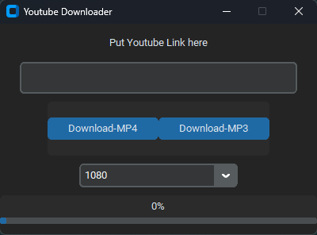

# YouTube-Downloader  

A simple application to download YouTube videos and audio in various formats and qualities.  

## Features  
- Download YouTube videos in resolutions from **360p to 1080p**.  
- Extract and download audio in **MP3** format.  
- Lightweight and easy to use.  

## Requirements  
- No additional software or libraries are needed.  

## Installation  
1. Download the latest release of **YouTube Downloader** from the [Releases](https://github.com/yourusername/youtube-downloader/releases) page.  
2. Extract the downloaded `.zip` file to a folder of your choice.  

## Usage  
1. Run the executable file (`youtuber_downloader.exe`).  
2. Follow the prompts to:  
   - Enter the YouTube URL.  
   - Choose the desired download format (video or MP3).  
   - Select the video resolution or proceed with the audio download.  

## Screenshot  
  

## License  
This project is licensed under the [MIT License](LICENSE).  

## Notes  
- Video resolution availability depends on the YouTube video.  
- Make sure you have permission to download content before using the app.  

## Disclaimer  
This app is for personal use only. The developer is not responsible for any misuse of this application.  
